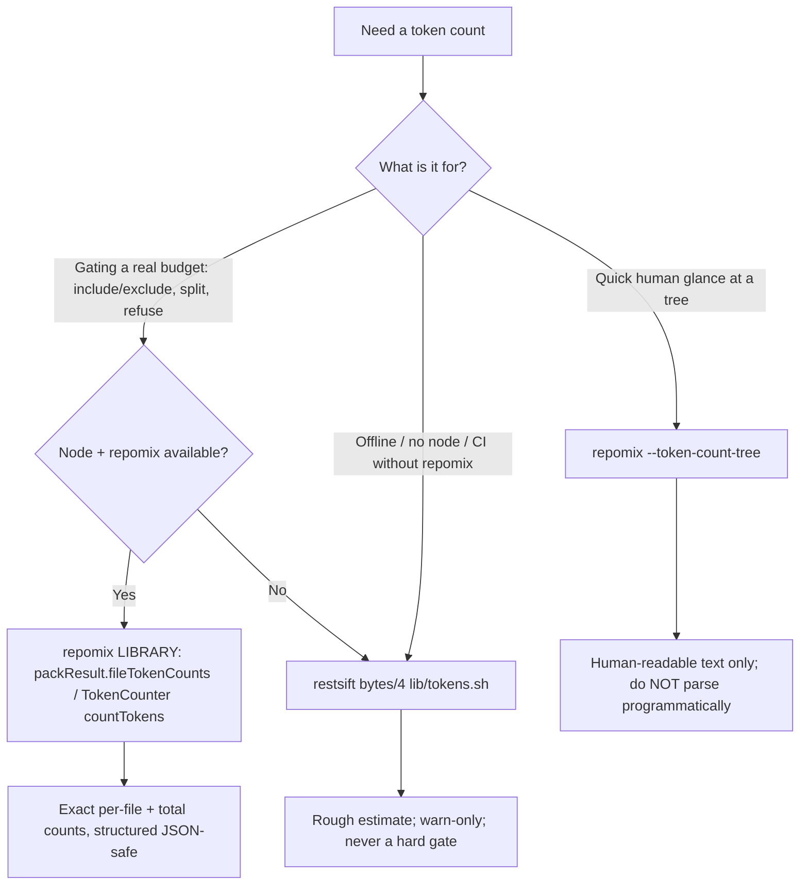

# Token-counting method index — which counter to trust

> **Audience:** humans AND LLM agents working in `restsift` (`/home/utmostcreator/Projects/restsift`, HEAD `ad648327d73a8ff1e6ee1fce34f7e76a51bfe0ee`).
> **One-sentence verdict:** For any decision that gates on a real token budget, use the repomix **library** (TokenCounter / packResult.fileTokenCounts) for exact, structured counts; use `--token-count-tree` only for a human glance; use restsift bytes/4 (`lib/tokens.sh`) only as an offline, no-node fallback — never as a budget gate.

---

## Why this exists

restsift currently estimates tokens as bytes/4 everywhere (`lib/tokens.sh:34-51`, `estimate_tokens`), and NO exact repomix token count is ever consumed (evidence F4/F6/F7). bytes/4 is fine for a rough preview but can be off by a wide margin for code, JSON, and non-Latin text, because real tokenizers (o200k_base) do not map 4 bytes to 1 token uniformly. When a real budget decision depends on the number — include/exclude a file, split a bundle, refuse a pack — an estimate that drifts causes silently wrong scoping. This doc fixes the method ranking.

## Decision flow



## Comparison

| Method | Accuracy | Structured-parse safety | Dependency cost | When to use |
|---|---|---|---|---|
| **repomix library packResult.fileTokenCounts / TokenCounter** | Exact (real o200k_base tokenizer) | High — returns numbers/objects (totalFiles, totalCharacters, totalTokens, fileTokenCounts, fileCharCounts) | node + repomix installed | **Default for any budget gate**; exact per-file and total counts |
| repomix --token-count-tree [threshold] | Exact underlying count, but rendered as a human tree | Low — human-readable text; fragile to parse, format can change | node + repomix installed | Quick human glance only; do NOT screen-scrape for logic |
| restsift bytes/4 (lib/tokens.sh estimate_tokens) | Rough (bytes/4) | High (single integer) but the number itself is approximate | none (pure bash) | Offline / no-node fallback; warn-only, never a hard gate |

## How to get exact counts (library, structured)

Import the repomix library and read `packResult` directly — it already carries the counts:

```js
import { runCli } from "repomix";
const result = await runCli(["."], process.cwd(), options);
const pr = result.packResult;
// pr.totalTokens, pr.totalFiles, pr.totalCharacters
// pr.fileTokenCounts  -> exact per-file token counts
// pr.fileCharCounts   -> exact per-file char counts
```

Or count an arbitrary string/file directly:

```js
import { TokenCounter } from "repomix";
const tc = new TokenCounter("o200k_base");
const tokens = tc.countTokens(content);
```

## Corrections (avoid these traps)

- **`--metrics-only` does NOT exist.** Any draft or agent that invokes `repomix --metrics-only` is wrong — the flag is invented. To keep metrics while dropping the big pack body, either generate-then-delete the output, or use `--no-files` for a metadata-only pass (directory structure + summary, no file bodies).
- **A custom JSON re-tokenizer is largely REDUNDANT.** The repomix JSON output (top-level: fileSummary, userProvidedHeader, directoryStructure, files map path->content, instruction) does NOT embed per-file token counts, so re-tokenizing the JSON body yourself is both extra work and a second source of drift. `packResult.fileTokenCounts` (and `totalTokens`) already provide authoritative exact per-file and total counts. Do not build a `repomix-measure.mjs`-style re-tokenizer when packResult already has the numbers.
- **Do not parse `--token-count-tree` text for logic.** It is a human display surface. If you need the numbers in code, call the library.

## LLM guidance (read this, agents)

> **AGENT DIRECTIVE — pick the counter by purpose, not by convenience:**
> 1. If your decision changes what gets packed, split, included, or refused because of a token budget: you MUST use the repomix **library** — `packResult.fileTokenCounts` / `packResult.totalTokens`, or `new TokenCounter("o200k_base").countTokens(...)`. These are exact and structured.
> 2. Never screen-scrape `--token-count-tree` output to drive logic. It is for humans.
> 3. Only fall back to restsift bytes/4 (`lib/tokens.sh`) when node or repomix is unavailable (offline / CI without repomix). Treat it as a warn-only estimate, never a hard gate.
> 4. Never call `repomix --metrics-only` — it does not exist.
> 5. Do not write a custom JSON re-tokenizer; packResult already carries the counts.
> In restsift, the sanctioned wiring for exact counts is the dormant `TOKEN_ESTIMATOR_CMD` hook at `lib/tokens.sh:37`: point it at a tiny repomix-TokenCounter shim that prints one integer, and the existing `estimate_tokens` path (`lib/tokens.sh:34-51`) consumes it with a bytes/4 fallback — no new plumbing, no fusing of the two-signature `estimate_tokens` (F8).
